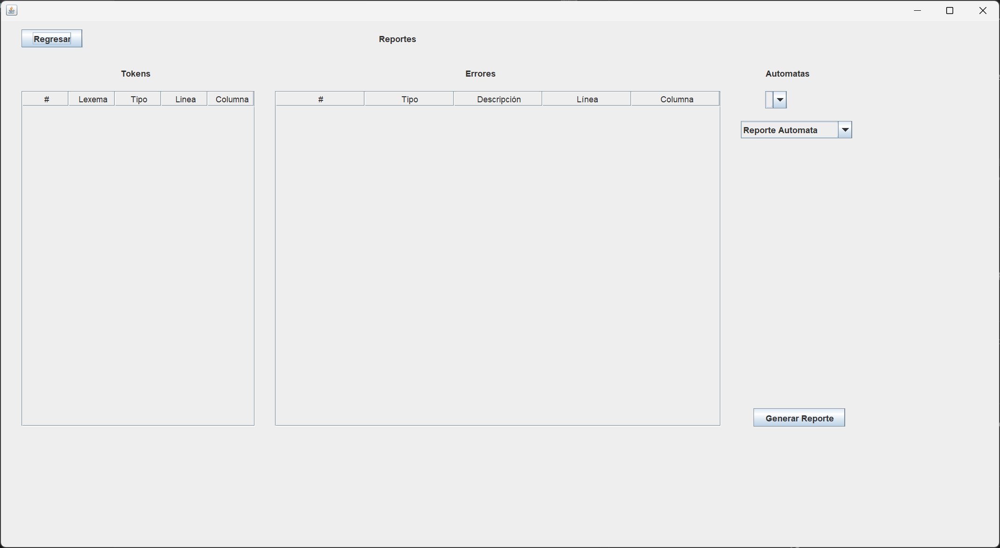
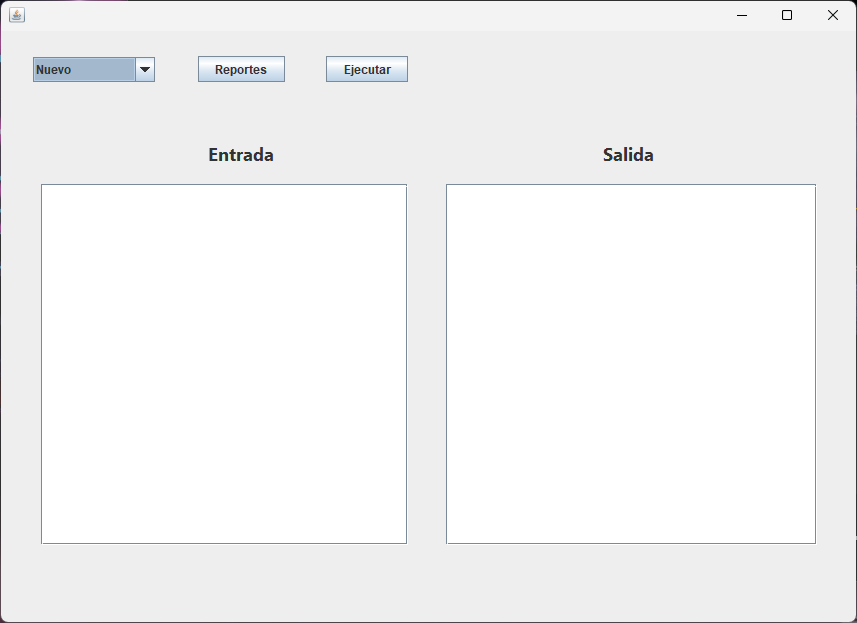

# Manual Tecnico - AutomataLab
### Nombre: Angel Emanuel Rodriguez Corado
### Carnet: 202404856

# Informacion del Proyecto

El lenguaje utilizado fue java.
Se utilizaron librerias como jflex(Version 1.7.0) y javacup(Version 11b) para la realizacion del analisis
lexico y sintactico.
Se utilizo el patron de diseño MVC.

# Estructura del Proyecto

## Clases
En este paquete se trabajan las diferentes clases utilizadas en este proyecto, las cuales son: 

- AFD

```java

public class AFD extends Automata {
    private List<TransicionAFD> transiciones;
    private List<PasoAFD> ultimosPasos;

    public AFD(String nombre, List<Estado> estados, List<String> alfabeto, Estado inicial, List<Estado> aceptacion, List<TransicionAFD> transiciones) {
        super(nombre);
        this.estados = estados;
        this.alfabeto = alfabeto;
        this.estadoInicial = inicial;
        this.estadosAceptacion = aceptacion;
        this.transiciones = transiciones;
    }

    @Override
    public boolean validarCadena(String cadena) {
        Estado actual = estadoInicial;
        for (char c : cadena.toCharArray()) {
            String simbolo = String.valueOf(c);
            TransicionAFD encontrada = null;
            for (TransicionAFD t : transiciones) {
                if (t.getOrigen().equals(actual) && t.getSimbolo().equals(simbolo)) {
                    encontrada = t;
                    break;
                }
            }
            if (encontrada == null) return false;
            actual = encontrada.getDestino();
        }
        return estadosAceptacion.contains(actual);
    }

    public List<TransicionAFD> getTransiciones() {
        return transiciones;
    }

    // Nuevo método para registrar pasos
    public List<PasoAFD> validarCadenaConPasos(String cadena) {
        List<PasoAFD> pasos = new ArrayList<>();
        Estado actual = estadoInicial;

        for (char c : cadena.toCharArray()) {
            String simbolo = String.valueOf(c);
            TransicionAFD encontrada = null;

            for (TransicionAFD t : transiciones) {
                if (t.getOrigen().equals(actual) && t.getSimbolo().equals(simbolo)) {
                    encontrada = t;
                    break;
                }
            }

            if (encontrada == null) {
                pasos.add(new PasoAFD(actual.getNombre(), simbolo, "ERROR"));
                ultimosPasos = pasos; // guardar pasos antes de salir
                return pasos;
            }

            pasos.add(new PasoAFD(actual.getNombre(), simbolo, encontrada.getDestino().getNombre()));
            actual = encontrada.getDestino();
        }

        if (estadosAceptacion.contains(actual)) {
            pasos.add(new PasoAFD(actual.getNombre(), "FIN", "ACEPTADO"));
        } else {
            pasos.add(new PasoAFD(actual.getNombre(), "FIN", "NO ACEPTADO"));
        }

        ultimosPasos = pasos; // guardar pasos al final
        return pasos;
    }
    
    public List<PasoAFD> getUltimosPasos() {
        return ultimosPasos;
    }

}


```

- AP
```java
public class AP extends Automata {
    private List<TransicionAP> transiciones;
    private List<String> simbolosPila; // alfabeto de la pila
    private Stack<String> pila;
    private List<PasoAP> ultimosPasos = new ArrayList<>();


    public AP(String nombre, List<Estado> estados, List<String> alfabeto, List<String> simbolosPila, Estado inicial, List<Estado> aceptacion, List<TransicionAP> transiciones) {
        super(nombre);
        this.estados = estados;
        this.alfabeto = alfabeto;
        this.simbolosPila = simbolosPila;
        this.estadoInicial = inicial;
        this.estadosAceptacion = aceptacion;
        this.transiciones = transiciones;
        this.pila = new Stack<>();
    }

    @Override
    public boolean validarCadena(String cadena) {
        Estado actual = estadoInicial;
        pila.clear();
        pila.push("#"); // base de pila
        List<PasoAP> pasos = new ArrayList<>();

        int i = 0; // índice de la cadena

        while (true) {
            String simbolo = (i < cadena.length()) ? String.valueOf(cadena.charAt(i)) : "$";
            boolean aplicada = false;

            for (TransicionAP t : transiciones) {
                if (t.getOrigen().equals(actual) &&
                   (t.getSimboloEntrada().equals(simbolo) || t.getSimboloEntrada().equals("$"))) {

                    // Extraer de la pila si no es lambda
                    String extraido = "$";
                    if (!t.getSimboloExtrae().equals("$")) {
                        if (pila.isEmpty() || !pila.peek().equals(t.getSimboloExtrae())) continue;
                        extraido = pila.pop();
                    }

                    // Insertar símbolos en la pila (en orden inverso)
                    List<String> simbolosInserta = new ArrayList<>();
                    if (!t.getSimboloInserta().equals("$")) {
                        for (int j = t.getSimboloInserta().length() - 1; j >= 0; j--) {
                            String s = String.valueOf(t.getSimboloInserta().charAt(j));
                            pila.push(s);
                            simbolosInserta.add(s);
                        }
                    }

                    // Guardar paso
                    pasos.add(new PasoAP(
                        actual.getNombre(),
                        t.getSimboloEntrada(),
                        extraido,
                        simbolosInserta,
                        t.getDestino().getNombre()
                    ));

                    actual = t.getDestino();
                    aplicada = true;

                    if (!t.getSimboloEntrada().equals("$")) i++; // consumir símbolo real
                    break;
                }
            }

            // Si no se aplicó ninguna transición, terminar y rechazar
            if (!aplicada) {
                this.ultimosPasos = pasos;
                System.out.println("[INFO] Pasos del AP guardados correctamente (" + pasos.size() + " pasos).");
                return false; // No hay transición válida, cadena inválida
            }

            // Si llegamos al final de la cadena y aplicamos transición final, salir
            if (i >= cadena.length() && simbolo.equals("$")) break;
        }

        // Guardar pasos
        this.ultimosPasos = pasos;
        System.out.println("[INFO] Pasos del AP guardados correctamente (" + pasos.size() + " pasos).");

        // Aceptar si estado final está en ACEPTACION **y** pila está en símbolo inicial
        return estadosAceptacion.contains(actual) && pila.size() == 1 && pila.peek().equals("#");
    }

    // Getter para los pasos
    public List<PasoAP> getUltimosPasos() {
        return ultimosPasos;
    }

    public List<TransicionAP> getTransiciones() {
        return transiciones;
    }

    public List<String> getSimbolosPila() {
        return simbolosPila;
    }
}

```
- Automata
```java
public abstract class Automata {
    protected String nombre;
    protected List<Estado> estados;
    protected List<String> alfabeto;
    protected Estado estadoInicial;
    protected List<Estado> estadosAceptacion;

    public Automata(String nombre) {
        this.nombre = nombre;
    }

    public String getNombre() {
        return nombre;
    }

    public List<Estado> getEstados() {
        return estados;
    }

    public List<String> getAlfabeto() {
        return alfabeto;
    }

    public Estado getEstadoInicial() {
        return estadoInicial;
    }

    public List<Estado> getEstadosAceptacion() {
        return estadosAceptacion;
    }

    public abstract boolean validarCadena(String cadena);
    }

```
- Estado
```java
public class Estado {
    private String nombre;
    private boolean esInicial;
    private boolean esAceptacion;

    public Estado(String nombre) {
        this.nombre = nombre;
        this.esInicial = false;
        this.esAceptacion = false;
    }

    public String getNombre() {
        return nombre;
    }

    public boolean isInicial() {
        return esInicial;
    }

    public void setInicial(boolean esInicial) {
        this.esInicial = esInicial;
    }

    public boolean isAceptacion() {
        return esAceptacion;
    }

    public void setAceptacion(boolean esAceptacion) {
        this.esAceptacion = esAceptacion;
    }

    @Override
    public String toString() {
        return nombre + (esInicial ? " (Inicial)" : "") + (esAceptacion ? " (Aceptación)" : "");
    }
}

```
- FuncionesAutomata
```java
public class FuncionesAutomata {

    // Lista todos los autómatas
    public static void verAutomatas() {
        AppControlador.agregarSalida("=== Lista de Autómatas ===");
        String lista = GestorAutomatas.verAutomatas(); // devuelve todo como String
        AppControlador.agregarSalida(lista);           // se imprime en JTextArea
        AppControlador.agregarSalida("==========================");
    }

    // Muestra descripción de un autómata
    public static void descripcionAutomata(String nombre) {
        Automata automata = GestorAutomatas.getAutomata(nombre);
        if (automata == null) {
            AppControlador.agregarSalida("El autómata \"" + nombre + "\" no existe.");
            return;
        }

        AppControlador.agregarSalida("=== Descripción del Autómata ===");
        AppControlador.agregarSalida("Nombre: " + automata.getNombre());
        AppControlador.agregarSalida("Tipo: " + ((automata instanceof AFD) ? "Autómata Finito Determinista" : "Autómata de Pila"));

        // Estados
        StringBuilder estados = new StringBuilder("Estados: ");
        for (Estado e : automata.getEstados()) estados.append(e.getNombre()).append(" ");
        AppControlador.agregarSalida(estados.toString());

        // Alfabeto
        StringBuilder alfabeto = new StringBuilder("Alfabeto: ");
        for (String s : automata.getAlfabeto()) alfabeto.append(s).append(" ");
        AppControlador.agregarSalida(alfabeto.toString());

        // Estado inicial
        AppControlador.agregarSalida("Estado Inicial: " + automata.getEstadoInicial().getNombre());

        // Estados de aceptación
        StringBuilder aceptacion = new StringBuilder("Estados de Aceptación: ");
        for (Estado e : automata.getEstadosAceptacion()) aceptacion.append(e.getNombre()).append(" ");
        AppControlador.agregarSalida(aceptacion.toString());

        // Transiciones
        AppControlador.agregarSalida("Transiciones:");
        if (automata instanceof AFD afd) {
            for (TransicionAFD t : afd.getTransiciones()) AppControlador.agregarSalida("  " + t.toString());
        } else if (automata instanceof AP ap) {
            for (TransicionAP t : ap.getTransiciones()) AppControlador.agregarSalida("  " + t.toString());
        }

        AppControlador.agregarSalida("================================");
    }

    // Validación de cadena
    public static void validarCadena(String nombre, String cadena) {
        Automata automata = GestorAutomatas.getAutomata(nombre);
        if (automata == null) {
            AppControlador.agregarSalida("El autómata \"" + nombre + "\" no existe.");
            return;
        }

        boolean resultado;

        if (automata instanceof AFD afd) {
            // Validar cadena y generar pasos
            List<PasoAFD> pasos = afd.validarCadenaConPasos(cadena);

            // La cadena es válida si el último paso indica "ACEPTADO"
            if (!pasos.isEmpty()) {
                resultado = pasos.get(pasos.size() - 1).getEstadoSiguiente().equals("ACEPTADO");
            } else {
                resultado = false;
            }

            System.out.println("[INFO] Pasos del AFD guardados correctamente (" + pasos.size() + " pasos).");

        } else {
            // Para AP, usar método normal
            resultado = automata.validarCadena(cadena);
        }

        AppControlador.agregarSalida(automata.getNombre() + "  " + cadena + "  " + (resultado ? "Cadena Válida" : "Cadena Inválida"));
    }
}

```

- GestorAutomatas
```java
public class GestorAutomatas {
    private static HashMap<String, Automata> automatas = new HashMap<>();

    public static void agregarAutomata(Automata automata) {
        automatas.put(automata.getNombre(), automata);
    }

    public static Automata getAutomata(String nombre) {
        return automatas.get(nombre);
    }

    public static String verAutomatas() {
        StringBuilder sb = new StringBuilder();
        for (String key : automatas.keySet()) {
            Automata a = automatas.get(key);
            String tipo = (a instanceof AFD) ? "Autómata Finito Determinista" : "Autómata de Pila";
            sb.append(a.getNombre()).append("   ").append(tipo).append("\n");
        }
        return sb.toString();
    }
    
    public static java.util.Set<String> getAutomatasNombres() {
        return automatas.keySet();
    }

}

```
- PasoAFD
```java
public class PasoAFD {
    private String estadoActual;
    private String simbolo;
    private String estadoSiguiente;

    public PasoAFD(String estadoActual, String simbolo, String estadoSiguiente) {
        this.estadoActual = estadoActual;
        this.simbolo = simbolo;
        this.estadoSiguiente = estadoSiguiente;
    }

    public String getEstadoActual() { return estadoActual; }
    public String getSimbolo() { return simbolo; }
    public String getEstadoSiguiente() { return estadoSiguiente; }

    @Override
    public String toString() {
        return estadoActual + " --" + simbolo + "--> " + estadoSiguiente;
    }
}

```
- PasoAP
```java
public class PasoAP {
    private String estadoActual;      // Estado en el que estamos
    private String simboloEntrada;    // Símbolo leído de la entrada
    private String simboloExtrae;     // Símbolo que se extrae de la pila
    private List<String> simbolosInserta; // Símbolos que se insertan en la pila (pueden ser varios)
    private String estadoSiguiente;   // Estado al que se mueve

    public PasoAP(String estadoActual, String simboloEntrada, String simboloExtrae, List<String> simbolosInserta, String estadoSiguiente) {
        this.estadoActual = estadoActual;
        this.simboloEntrada = simboloEntrada;
        this.simboloExtrae = simboloExtrae;
        this.simbolosInserta = simbolosInserta;
        this.estadoSiguiente = estadoSiguiente;
    }

    // Getters
    public String getEstadoActual() { return estadoActual; }
    public String getSimboloEntrada() { return simboloEntrada; }
    public String getSimboloExtrae() { return simboloExtrae; }
    public List<String> getSimbolosInserta() { return simbolosInserta; }
    public String getEstadoSiguiente() { return estadoSiguiente; }

    @Override
    public String toString() {
        return estadoActual + " --" + simboloEntrada + "/" + simboloExtrae + "->" + simbolosInserta + "--> " + estadoSiguiente;
    }

    // Método estático para convertir una lista de pasos en texto para debug
    public static String mostrarPasos(List<PasoAP> pasos) {
        StringBuilder sb = new StringBuilder();
        for (PasoAP paso : pasos) {
            sb.append(paso.toString()).append("\n");
        }
        return sb.toString();
    }
}

```
- TokenModelo
```java
public class TokenModelo {
    private String lexema;
    private String tipo;
    private int linea;
    private int columna;

    public TokenModelo(String lexema, String tipo, int linea, int columna) {
        this.lexema = lexema;
        this.tipo = tipo;
        this.linea = linea;
        this.columna = columna;
    }

    public String getLexema() {
        return lexema;
    }

    public String getTipo() {
        return tipo;
    }

    public int getLinea() {
        return linea;
    }

    public int getColumna() {
        return columna;
    }

    @Override
    public String toString() {
        return "Token[" + tipo + "] '" + lexema + "' (L:" + linea + ", C:" + columna + ")";
    }
}

```
- TokenRepositorio
```java
public class TokenRepositorio {

    private static TokenModelo[] listaTokens = new TokenModelo[500]; // capacidad máxima
    private static int cantidad = 0;

    // Limpia el repositorio antes de un nuevo análisis
    public static void limpiar() {
        cantidad = 0;
        listaTokens = new TokenModelo[1000];
    }

    // Agrega un nuevo token
    public static void agregarToken(TokenModelo token) {
        if (cantidad < listaTokens.length) {
            listaTokens[cantidad] = token;
            cantidad++;
        } else {
            System.out.println("❌ Error: límite de tokens alcanzado.");
        }
    }

    // Devuelve todos los tokens como un vector
    public static TokenModelo[] getTokens() {
        TokenModelo[] tokensValidos = new TokenModelo[cantidad];
        for (int i = 0; i < cantidad; i++) {
            tokensValidos[i] = listaTokens[i];
        }
        return tokensValidos;
    }

    // Cantidad actual de tokens almacenados
    public static int getCantidad() {
        return cantidad;
    }
}
```
- TransicionAFD
```java

```
- TransicionAP
```java
public class TransicionAFD {
    private Estado origen;
    private String simbolo;
    private Estado destino;
    
    // Constructor por defecto
    public TransicionAFD() {}
    
    // Constructor con parámetros
    public TransicionAFD(Estado origen, String simbolo, Estado destino) {
        this.origen = origen;
        this.simbolo = simbolo;
        this.destino = destino;
    }
    
    // Setters
    public void setOrigen(Estado origen) { this.origen = origen; }
    public void setSimbolo(String simbolo) { this.simbolo = simbolo; }
    public void setDestino(Estado destino) { this.destino = destino; }
    
    // Getters
    public Estado getOrigen() { return origen; }
    public String getSimbolo() { return simbolo; }
    public Estado getDestino() { return destino; }
    
    @Override
    public String toString() {
        if (origen == null || destino == null) {
            return "TransicionAFD[INVALIDA]";
        }
        return origen.getNombre() + " --" + simbolo + "--> " + destino.getNombre();
    }
}
```

## Controlador
Aqui se desarrollaro el codigo de los controladores de la aplicacion los cuales sirven de puentre entre la vista 
al usuario y la logica del proyecto (Conexion entre Clases, Analizadores, etc.) Estos son:

- AnalizadorLexicoControlador
```java
public class AnalizadorLexicoControlador {

    public String ejecutarAnalisisLexico(String entrada) {
        StringBuilder resultado = new StringBuilder();
        try {
            TokenRepositorio.limpiar();
            AnalizadorLexico lexer = new AnalizadorLexico(new StringReader(entrada));
            Symbol simbolo;

            while ((simbolo = lexer.next_token()).sym != sym.EOF) {
                String tipo = sym.terminalNames[simbolo.sym];
                String lexema = (simbolo.value != null) ? simbolo.value.toString() : "";

                // Usar simbolo.left y simbolo.right para línea y columna
                TokenModelo token = new TokenModelo(
                        lexema,
                        tipo,
                        simbolo.left,
                        simbolo.right
                );
                TokenRepositorio.agregarToken(token);

                resultado.append(token.toString()).append("\n");
            }
        } catch (Exception e) {
            resultado.append("Error léxico: ").append(e.getMessage());
        }
        return resultado.toString();
    }
}


```
- AnalizadorSintacticoControlador
```java
public class AnalizadorSintacticoControlador {

    public String ejecutarAnalisisSintactico(String entrada) {
        String resultado = "";
        try {
            AnalizadorLexico lexer = new AnalizadorLexico(new StringReader(entrada));
            AnalizadorSintactico parser = new AnalizadorSintactico(lexer);

            Symbol s = parser.parse();

            if (s != null && s.value != null) {
                resultado = "Análisis sintáctico exitoso.\nResultado: " + s.value.toString();
            } else {
                resultado = "Análisis sintáctico completado sin errores.";
            }
        } catch (Exception e) {
            resultado = "Error sintáctico: " + e.getMessage();
            e.printStackTrace();
        }
        System.out.println(resultado.toString());
        return resultado;
    }
}

```
- AppControlador
```java
public class AppControlador {
    private static VistaGeneral vista;
    private AnalizadorLexicoControlador lexCtrl;
    private AnalizadorSintacticoControlador sintCtrl;

    // Variable para guardar la ruta actual del archivo
    private String rutaActual = null;

    public AppControlador(VistaGeneral vista) {
        AppControlador.vista = vista; // asigna referencia
        this.lexCtrl = new AnalizadorLexicoControlador();
        this.sintCtrl = new AnalizadorSintacticoControlador();

        this.vista.Ejecutar.addActionListener(e -> ejecutarAnalisis());
        this.vista.Reportes.addActionListener(e -> AbrirReportes());

        // Nuevo: listener para el ComboBox de archivo
        this.vista.ArchivoCombox.addActionListener(e -> manejarArchivoCombox());
    }

    private void ejecutarAnalisis() {
        String entrada = vista.Entrada.getText();
        vista.Salida.setText("");
        TokenRepositorio.limpiar(); // reinicia tokens
        erroresLexicos = new ArrayList<>(); // reinicia lista de errores léxicos
        erroresSintacticos = new ArrayList<>(); 

        lexCtrl.ejecutarAnalisisLexico(entrada);
        sintCtrl.ejecutarAnalisisSintactico(entrada);

        int cantidadTokens = TokenRepositorio.getCantidad();
        int erroresLex = erroresLexicos.size();
        int erroresSint = erroresSintacticos.size();
        int totalErrores = erroresLex + erroresSint;

        StringBuilder resumen = new StringBuilder();
        resumen.append("=== RESUMEN DEL ANÁLISIS ===\n");
        if (totalErrores == 0) {
            resumen.append("Análisis léxico realizado con éxito.\n");
            resumen.append("Análisis sintáctico realizado con éxito.\n");
        } else {
            resumen.append("Se encontraron ").append(totalErrores).append(" errores.\n");
            resumen.append("Errores léxicos: ").append(erroresLex).append("\n");
            resumen.append("Errores sintácticos: ").append(erroresSint).append("\n");
        }
        resumen.append("Cantidad de tokens: ").append(cantidadTokens).append("\n");

        agregarSalida(resumen.toString());
    }

    private void AbrirReportes() {
        PROYECTO1COMPI.abrirReportes();
    }

    public static void agregarSalida(String mensaje) {
        if (vista != null) {
            vista.Salida.append(mensaje + "\n");
            vista.Salida.setCaretPosition(vista.Salida.getDocument().getLength());
        }
    }

    // ----------------- MÉTODOS PARA ARCHIVO -----------------

    private void manejarArchivoCombox() {
        String seleccion = (String) vista.ArchivoCombox.getSelectedItem();
        if (seleccion == null) return;

        switch (seleccion) {
            case "Nuevo":
                nuevoArchivo();
                break;
            case "Abrir":
                abrirArchivo();
                break;
            case "Guardar":
                guardarArchivo();
                break;
        }
    }

    private void nuevoArchivo() {
        vista.Entrada.setText("");    // limpia el área de texto
        vista.Salida.setText("");     // limpia la salida
        rutaActual = null;            // resetea ruta
        agregarSalida("[INFO] Nuevo archivo creado.");
    }

    private void abrirArchivo() {
        JFileChooser fileChooser = new JFileChooser();
        FileNameExtensionFilter filtro = new FileNameExtensionFilter("Archivos .atm", "atm");
        fileChooser.setFileFilter(filtro);

        int resultado = fileChooser.showOpenDialog(vista);
        if (resultado == JFileChooser.APPROVE_OPTION) {
            File archivo = fileChooser.getSelectedFile();
            rutaActual = archivo.getAbsolutePath();

            try (BufferedReader br = new BufferedReader(new FileReader(archivo))) {
                StringBuilder contenido = new StringBuilder();
                String linea;
                while ((linea = br.readLine()) != null) {
                    contenido.append(linea).append("\n");
                }
                vista.Entrada.setText(contenido.toString());
                agregarSalida("[INFO] Archivo abierto: " + archivo.getName());
            } catch (IOException e) {
                agregarSalida("[ERROR] No se pudo abrir el archivo: " + e.getMessage());
            }
        }
    }

    private void guardarArchivo() {
        if (rutaActual == null) {
            // Si no hay archivo existente, usar guardar como
            JFileChooser fileChooser = new JFileChooser();
            FileNameExtensionFilter filtro = new FileNameExtensionFilter("Archivos .atm", "atm");
            fileChooser.setFileFilter(filtro);

            int resultado = fileChooser.showSaveDialog(vista);
            if (resultado == JFileChooser.APPROVE_OPTION) {
                File archivo = fileChooser.getSelectedFile();
                // Asegurarse que tenga extensión .atm
                if (!archivo.getName().endsWith(".atm")) {
                    archivo = new File(archivo.getAbsolutePath() + ".atm");
                }
                rutaActual = archivo.getAbsolutePath();
            } else {
                return; // cancelar guardado
            }
        }

        // Guardar contenido actual
        try (BufferedWriter bw = new BufferedWriter(new FileWriter(rutaActual))) {
            bw.write(vista.Entrada.getText());
            agregarSalida("[INFO] Archivo guardado correctamente: " + new File(rutaActual).getName());
        } catch (IOException e) {
            agregarSalida("[ERROR] No se pudo guardar el archivo: " + e.getMessage());
        }
    }
}

```
- ReportesControlador
```java
public class ReportesControlador {

    private Reportes vista;

    public ReportesControlador(Reportes vista) {
        this.vista = vista;

        this.vista.Regresar.addActionListener(e -> Regresar());
        this.vista.GenerarReporte.addActionListener(e -> generarReporteSeleccionado());

        // Cargar autómatas al iniciar
        cargarAutomatas();
    }

    // -------------------------------
    // Cargar autómatas en el JComboBox
    // -------------------------------
    public void cargarAutomatas() {
        vista.Automatas.removeAllItems(); // Limpiar antes de agregar
        for (String nombre : GestorAutomatas.getAutomatasNombres()) {
            vista.Automatas.addItem(nombre);
        }
    }

    // -------------------------------
    // Mostrar tokens en la tabla
    // -------------------------------
    public void mostrarTokens() {
        TokenModelo[] tokens = TokenRepositorio.getTokens();
        String[] columnas = {"#", "Lexema", "Tipo", "Linea", "Columna"};

        javax.swing.table.DefaultTableModel modelo = new javax.swing.table.DefaultTableModel(columnas, 0) {
            @Override
            public boolean isCellEditable(int row, int column) {
                return false;
            }
        };

        for (int i = 0; i < tokens.length; i++) {
            TokenModelo token = tokens[i];
            Object[] fila = {i + 1, token.getLexema(), token.getTipo(), token.getLinea(), token.getColumna()};
            modelo.addRow(fila);
        }

        vista.Tokens.setModel(modelo);
    }

    // -------------------------------
    // Mostrar errores en la tabla
    // -------------------------------
    public void mostrarErrores(ArrayList<ErrorLexico> erroresLexicos, ArrayList<ErrorSintactico> erroresSintacticos) {
        String[] columnas = {"#", "Tipo", "Descripción", "Línea", "Columna"};
        javax.swing.table.DefaultTableModel modelo = new javax.swing.table.DefaultTableModel(columnas, 0) {
            @Override
            public boolean isCellEditable(int row, int column) { return false; }
        };

        int contador = 1;
        for (ErrorLexico error : erroresLexicos) {
            String tipo = "Léxico";
            String descripcion = error.toString();
            int linea = error.getLinea();
            int columna = error.getColumna();
            Object[] fila = {contador++, tipo, descripcion, linea, columna};
            modelo.addRow(fila);
        }

        for (ErrorSintactico error : erroresSintacticos) {
            String tipo = "Sintáctico";
            String descripcion = error.toString();
            int linea = error.linea;
            int columna = error.columna;
            Object[] fila = {contador++, tipo, descripcion, linea, columna};
            modelo.addRow(fila);
        }

        vista.Pasos.setModel(modelo);

        vista.Pasos.getColumnModel().getColumn(2).setCellRenderer(new javax.swing.table.DefaultTableCellRenderer() {
            @Override
            public java.awt.Component getTableCellRendererComponent(JTable table, Object value,
                    boolean isSelected, boolean hasFocus, int row, int column) {
                JTextArea area = new JTextArea(value != null ? value.toString() : "");
                area.setLineWrap(true);
                area.setWrapStyleWord(true);
                area.setOpaque(true);
                if (isSelected) {
                    area.setBackground(table.getSelectionBackground());
                    area.setForeground(table.getSelectionForeground());
                } else {
                    area.setBackground(table.getBackground());
                    area.setForeground(table.getForeground());
                }
                int alturaPreferida = area.getPreferredSize().height;
                if (table.getRowHeight(row) != alturaPreferida) {
                    table.setRowHeight(row, alturaPreferida);
                }
                return area;
            }
        });
    }

    // -------------------------------
    // Generar reporte según selección
    // -------------------------------
    private void generarReporteSeleccionado() {
        String nombreAutomata = (String) vista.Automatas.getSelectedItem();
        String tipoReporte = (String) vista.TipoReporte.getSelectedItem();

        if (nombreAutomata == null || tipoReporte == null) {
            System.err.println("Seleccione un autómata y un tipo de reporte");
            return;
        }

        Automata automata = GestorAutomatas.getAutomata(nombreAutomata);

        switch (tipoReporte) {
            case "Reporte Automata":
                ReporteAutomatas.generarDot(automata, "Reportes/" + nombreAutomata);
                break;

            case "Reporte de Pasos AFD":
                if (automata instanceof AFD) {
                    AFD afd = (AFD) automata;

                    //Verificar que haya pasos guardados
                    List<PasoAFD> pasos = afd.getUltimosPasos();
                    if (pasos == null || pasos.isEmpty()) {
                        System.err.println("No hay pasos disponibles. Valide la cadena primero.");
                        return;
                    }

                    //Generar reporte de pasos
                    ReportePasosAFD.generarReporte(pasos, afd, "Reportes/" + nombreAutomata + "_PasosAFD");
                } else {
                    System.err.println("El autómata seleccionado no es un AFD");
                }
                break;

            case "Reporte de Pasos AP":
                if (automata instanceof AP) {
                    ReportePasosAP.generarReporte((AP) automata, "Reportes/" + nombreAutomata + "_PasosAP");
                } else {
                    System.err.println("El autómata seleccionado no es un AP");
                }
                break;

            default:
                System.err.println("Tipo de reporte desconocido");
        }
    }

    private void Regresar() {
        PROYECTO1COMPI.cerrarReportes();
        PROYECTO1COMPI.abrirVistaGeneral();
    }
}

```

## Prueba
Este contiene un archivo de prueba para el proyecto con extension .atm

## Parser
Aqui es donde se encuentran los analizadoreso encargados de analizar los diferentes automatas en las entradas:

- AnalizadorLexico
- AnalizadorSintactico
- sym
```java
public class sym {
  /* terminals */
  public static final int TRANSICIONES = 8;
  public static final int MENOR = 2;
  public static final int CADENA = 23;
  public static final int DESC = 10;
  public static final int OR = 20;
  public static final int IGUAL = 11;
  public static final int FLECHA = 19;
  public static final int AFD = 5;
  public static final int ID = 21;
  public static final int AP = 6;
  public static final int DOS_PUNTOS = 18;
  public static final int VER_AUTOMATAS = 9;
  public static final int PAREN_IZQ = 14;
  public static final int COMA = 16;
  public static final int PAREN_DER = 15;
  public static final int NOMBRE = 7;
  public static final int MAYOR = 3;
  public static final int EOF = 0;
  public static final int NUMERO = 22;
  public static final int error = 1;
  public static final int LLAVE_IZQ = 12;
  public static final int PUNTO_COMA = 17;
  public static final int LLAVE_DER = 13;
  public static final int MENOR_DIAGONAL = 4;
  public static final int STACKTOP = 25;
  public static final int LAMBDA = 24;

  public static final String[] terminalNames = {
    "EOF",              // 0
    "error",            // 1
    "MENOR",            // 2
    "MAYOR",            // 3
    "MENOR_DIAGONAL",   // 4
    "AFD",              // 5
    "AP",               // 6
    "NOMBRE",           // 7
    "TRANSICIONES",     // 8
    "VER_AUTOMATAS",    // 9
    "DESC",             // 10
    "IGUAL",            // 11
    "LLAVE_IZQ",        // 12
    "LLAVE_DER",        // 13
    "PAREN_IZQ",        // 14
    "PAREN_DER",        // 15
    "COMA",             // 16
    "PUNTO_COMA",       // 17
    "DOS_PUNTOS",       // 18
    "FLECHA",           // 19
    "OR",               // 20
    "ID",               // 21
    "NUMERO",           // 22
    "CADENA",           // 23
    "LAMBDA",           // 24
    "STACKTOP"          // 25
  };
}

```

## Reportes

Aqui es donde se guardan los diferentes tipos de reportes que se utilizan en la vista de Reportes, los cuales son: 

- ReporteAutomatas
```java
public class ReporteAutomatas {

    public static void generarDot(Automata automata, String rutaSalida) {
        if (automata == null) {
            System.err.println("ReporteAutomatas: autómata nulo");
            return;
        }

        //Verificar y crear carpeta si no existe
        File archivoDestino = new File(rutaSalida);
        File carpeta = archivoDestino.getParentFile();
        if (carpeta != null && !carpeta.exists()) {
            if (carpeta.mkdirs()) {
                System.out.println("[INFO] Carpeta creada: " + carpeta.getAbsolutePath());
            }
        }

        // Resumen del automata
        StringBuilder resumen = new StringBuilder();
        resumen.append("Nombre: ").append(automata.getNombre()).append("\\l"); // \l para salto de línea a la izquierda
        resumen.append("Tipo: ").append(automata instanceof AFD ? "AFD" : "AP").append("\\l");
        resumen.append("Estado Inicial: ").append(
                automata.getEstadoInicial() != null ? automata.getEstadoInicial().getNombre() : "N/A"
        ).append("\\l");
        resumen.append("Estados de Aceptación: ");
        List<Estado> aceptaciones = automata.getEstadosAceptacion();
        if (aceptaciones != null && !aceptaciones.isEmpty()) {
            for (Estado e : aceptaciones) {
                resumen.append(e.getNombre()).append(" ");
            }
        } else {
            resumen.append("Ninguno");
        }
        resumen.append("\\l");

        if (automata instanceof AFD) {
            AFD afd = (AFD) automata;
            resumen.append("Alfabeto: ").append(
                    afd.getAlfabeto() != null ? afd.getAlfabeto().toString() : "N/A"
            ).append("\\l");
        } else if (automata instanceof AP) {
            AP ap = (AP) automata;
            resumen.append("Alfabeto Entrada: ").append(
                    ap.getAlfabeto() != null ? ap.getAlfabeto().toString() : "N/A"
            ).append("\\l");
            resumen.append("Alfabeto Pila: ").append(
                    ap.getSimbolosPila() != null ? ap.getSimbolosPila().toString() : "N/A"
            ).append("\\l");
        }

        //Generar dot
        StringBuilder sb = new StringBuilder();
        sb.append("digraph G {\n");
        sb.append("  rankdir=LR;\n");
        sb.append("  node [shape=circle,fontname=\"Helvetica\"];\n\n");

        // Nodo resumen (visible en la imagen)
        sb.append("  info [shape=box, style=filled, fillcolor=lightgray, label=\"")
          .append(resumen.toString())
          .append("\"];\n\n");

        Estado inicial = automata.getEstadoInicial();
        if (inicial != null) {
            sb.append("  __inicio [shape=point];\n");
            sb.append("  __inicio -> \"").append(escape(inicial.getNombre())).append("\";\n\n");
        }

        List<Estado> estados = automata.getEstados();
        for (Estado e : estados) {
            String name = escape(e.getNombre());
            sb.append("  \"").append(name).append("\"")
              .append(aceptaciones != null && aceptaciones.contains(e) ? " [shape=doublecircle]" : " [shape=circle]")
              .append(";\n");
        }
        sb.append("\n");

        if (automata instanceof AFD) {
            AFD afd = (AFD) automata;
            List<TransicionAFD> trans = afd.getTransiciones();
            if (trans != null) {
                for (TransicionAFD t : trans) {
                    sb.append("  \"").append(escape(t.getOrigen().getNombre())).append("\" -> \"")
                      .append(escape(t.getDestino().getNombre())).append("\"")
                      .append(" [label=\"").append(escape(t.getSimbolo())).append("\"];\n");
                }
            }
        } else if (automata instanceof AP) {
            AP ap = (AP) automata;
            List<TransicionAP> trans = ap.getTransiciones();
            if (trans != null) {
                for (TransicionAP t : trans) {
                    String label = "(" + escape(t.getSimboloEntrada()) + ") "
                                 + escape(t.getSimboloExtrae()) + "->" + escape(t.getSimboloInserta());
                    sb.append("  \"").append(escape(t.getOrigen().getNombre())).append("\" -> \"")
                      .append(escape(t.getDestino().getNombre())).append("\"")
                      .append(" [label=\"").append(label).append("\"];\n");
                }
            }
        }

        sb.append("}\n");

        // Guardar archivo DOT y generar PNG
        try {
            File fileDot = new File(rutaSalida + ".dot");
            try (FileWriter fw = new FileWriter(fileDot)) {
                fw.write(sb.toString());
            }
            System.out.println("Reporte DOT generado: " + rutaSalida + ".dot");

            // Ejecutar Graphviz (solo PNG)
            String comando = "dot -Tpng " + fileDot.getAbsolutePath() + " -o " + rutaSalida + ".png";
            Process proceso = Runtime.getRuntime().exec(comando);
            int exitCode = proceso.waitFor();
            if (exitCode == 0) {
                System.out.println("Imagen PNG generada: " + rutaSalida + ".png");
            } else {
                System.err.println("Error al generar PNG: código " + exitCode);
            }

        } catch (IOException | InterruptedException ex) {
            System.err.println("Error al escribir DOT/PNG: " + ex.getMessage());
        }
    }

    private static String escape(String s) {
        if (s == null) return "";
        return s.replace("\"", "\\\"");
    }
}

```
- ReportePasosAFD
```java
public class ReportePasosAFD {

    public static void generarReporte(List<PasoAFD> pasos, AFD afd, String nombreArchivo) {
        if (pasos == null || pasos.isEmpty()) {
            System.out.println("[WARN] No hay pasos para generar el reporte.");
            return;
        }

        StringBuilder dot = new StringBuilder();
        dot.append("digraph G {\n");
        dot.append("    rankdir=LR;\n"); // de izquierda a derecha
        dot.append("    node [shape=circle];\n\n");

        // Dibujar todos los estados y marcar los de aceptación
        for (Estado e : afd.getEstados()) {
            if (afd.getEstadosAceptacion().contains(e)) {
                dot.append("    ").append(e.getNombre())
                   .append(" [shape=doublecircle, style=filled, fillcolor=lightgreen];\n");
            } else {
                dot.append("    ").append(e.getNombre()).append(" [shape=circle];\n");
            }
        }
        dot.append("\n");

        // Estado inicial
        dot.append("    init [shape=point];\n");
        dot.append("    init -> ").append(afd.getEstadoInicial().getNombre()).append(";\n\n");

        // Dibujar todas las transiciones del AFD en gris claro
        for (TransicionAFD t : afd.getTransiciones()) {
            dot.append("    ")
               .append(t.getOrigen().getNombre())
               .append(" -> ")
               .append(t.getDestino().getNombre())
               .append(" [label=\"").append(t.getSimbolo()).append("\", color=lightgray];\n");
        }
        dot.append("\n");

        // Dibujar los pasos de la cadena en azul y más grueso, con número de paso
        int pasoNum = 1;
        for (PasoAFD p : pasos) {
            String etiqueta = p.getSimbolo() + " (" + pasoNum + ")";
            dot.append("    ")
               .append(p.getEstadoActual())
               .append(" -> ")
               .append(p.getEstadoSiguiente())
               .append(" [label=\"").append(etiqueta)
               .append("\", color=blue, penwidth=2.5];\n");
            pasoNum++;
        }

        dot.append("}\n");

        // Guardar archivo DOT y generar PNG
        try {
            File carpeta = new File("Reportes");
            if (!carpeta.exists()) {
                carpeta.mkdirs();
                System.out.println("[INFO] Carpeta 'Reportes' creada correctamente.");
            }

            File dotFile = new File(nombreArchivo + ".dot");
            try (FileWriter fw = new FileWriter(dotFile)) {
                fw.write(dot.toString());
            }
            System.out.println("[INFO] Archivo DOT generado: " + dotFile.getAbsolutePath());

            String comando = "dot -Tpng " + dotFile.getAbsolutePath() + " -o " + nombreArchivo + ".png";
            Process proceso = Runtime.getRuntime().exec(comando);
            proceso.waitFor();
            System.out.println("[INFO] Imagen PNG generada: " + nombreArchivo + ".png");

        } catch (IOException | InterruptedException e) {
            System.err.println("[ERROR] No se pudo generar el reporte: " + e.getMessage());
        }
    }
}

```
- ReportePasosAP
```java
public class ReportePasosAP {

    public static void generarReporte(AP automata, String nombreArchivo) {
        List<PasoAP> pasos = automata.getUltimosPasos();
        if (pasos == null || pasos.isEmpty()) {
            System.out.println("[WARN] No hay pasos para generar el reporte.");
            return;
        }

        StringBuilder dot = new StringBuilder();
        dot.append("digraph G {\n");
        dot.append("rankdir=LR;\n");
        dot.append("node [shape=box, style=filled, color=lightblue, fontname=\"Helvetica\"];\n");
        dot.append("splines=true;\n");
        dot.append("ranksep=1.2;\n");
        dot.append("nodesep=0.6;\n");

        int pasoNum = 1;

        for (PasoAP paso : pasos) {
            String estadoActual = paso.getEstadoActual();
            String estadoSiguiente = paso.getEstadoSiguiente();
            String simboloEntrada = paso.getSimboloEntrada();
            String extraido = paso.getSimboloExtrae();
            List<String> pila = paso.getSimbolosInserta();

            // Nodo principal del paso con número
            String nodoPaso = String.format(
                    "Paso%d [label=\"Paso %d\\n%s -> %s\\nEntrada: %s\\nExtraído: %s\"];\n",
                    pasoNum, pasoNum, estadoActual, estadoSiguiente, simboloEntrada, extraido);
            dot.append(nodoPaso);

            // Mostrar pila vertical
            if (pila != null && !pila.isEmpty()) {
                String prevNodo = null;
                int pilaNum = 1;
                for (int i = pila.size() - 1; i >= 0; i--) { // de arriba hacia abajo
                    String simbolo = pila.get(i);
                    String nodoPila = String.format(
                            "Paso%d_Pila%d [label=\"%s\", shape=ellipse, style=filled, color=lightyellow];\n",
                            pasoNum, pilaNum, simbolo);
                    dot.append(nodoPila);

                    if (prevNodo != null) {
                        dot.append(String.format("%s -> %s [dir=back, style=dashed];\n", nodoPila, prevNodo));
                    }

                    prevNodo = String.format("Paso%d_Pila%d", pasoNum, pilaNum);
                    pilaNum++;
                }

                // Conectar nodo principal con el tope de la pila
                if (prevNodo != null) {
                    dot.append(String.format("Paso%d -> %s [style=dotted];\n", pasoNum, prevNodo));
                }
            }

            // Conectar pasos entre sí
            if (pasoNum > 1) {
                dot.append(String.format("Paso%d -> Paso%d [style=bold];\n", pasoNum - 1, pasoNum));
            }

            pasoNum++;
        }

        // Determinar si la cadena fue aceptada: 
        // Cadena válida si último paso terminó en un estado de aceptación del AP
        PasoAP ultimoPaso = pasos.get(pasos.size() - 1);
        String estadoFinal = ultimoPaso.getEstadoSiguiente();
        boolean aceptado = automata.getEstadosAceptacion().stream()
                .anyMatch(e -> e.getNombre().equals(estadoFinal));
        String resultado = aceptado ? "ACEPTADO" : "NO ACEPTADO";
        String colorResultado = aceptado ? "green" : "red";

        // Nodo final
        dot.append(String.format("Resultado [label=\"%s\", shape=box, style=filled, color=%s, fontname=\"Helvetica\"];\n",
                resultado, colorResultado));
        dot.append(String.format("Paso%d -> Resultado [style=bold];\n", pasoNum - 1));

        dot.append("}\n");

        try {
            // Crear carpeta si no existe
            File archivoDestino = new File(nombreArchivo);
            File carpeta = archivoDestino.getParentFile();
            if (carpeta != null && !carpeta.exists()) carpeta.mkdirs();

            // Guardar DOT
            File fileDot = new File(nombreArchivo + ".dot");
            try (FileWriter writer = new FileWriter(fileDot)) {
                writer.write(dot.toString());
            }

            // Generar PNG
            String comando = String.format("dot -Tpng %s -o %s.png",
                    fileDot.getAbsolutePath(), nombreArchivo);
            Process proceso = Runtime.getRuntime().exec(comando);
            proceso.waitFor();

            System.out.println("[OK] Reporte generado: " + nombreArchivo + ".png");
        } catch (IOException | InterruptedException e) {
            e.printStackTrace();
        }
    }
}

```
### Vistas

Aqui es donde se guardan las vistas del proyecto, con lo que el usuario interactua, las cuales son: 

- Reportes


- VistaGeneral


### proyecto1.compi

Este es el paquete que guarda el main:

- PROYECTO1COMPI
```java
public class PROYECTO1COMPI {

    // Instancias estáticas de las vistas
    private static VistaGeneral vistaGeneral;
    private static Reportes vistaReportes;
    private static ReportesControlador controladorReportes;


    public static void main(String[] args) {
        
        
        // Inicializa la vista principal
        vistaGeneral = new VistaGeneral();
        AppControlador app = new AppControlador(vistaGeneral);
        vistaGeneral.setVisible(true);
    }

    public static void abrirVistaGeneral() {
        if (vistaGeneral == null) {
            vistaGeneral = new VistaGeneral();
            new AppControlador(vistaGeneral); // asigna el controlador
        }
        vistaGeneral.setVisible(true);
    }

    public static void cerrarVistaGeneral() {
        if (vistaGeneral != null) {
            vistaGeneral.setVisible(false);
        }
    }

    public static void abrirReportes() {
        if (vistaReportes == null) {
            vistaReportes = new Reportes();
            controladorReportes = new ReportesControlador(vistaReportes);
        }
        vistaReportes.setVisible(true);
        controladorReportes.mostrarTokens();
        controladorReportes.mostrarErrores(erroresLexicos, erroresSintacticos);
    }
      
    public static void cerrarReportes() {
        if (vistaReportes != null) {
            vistaReportes.setVisible(false);
        }
    }

    public static Reportes getVistaReportes() {
        return vistaReportes;    
    }
    
    public static ReportesControlador getControladorReportes() {
        return controladorReportes;
    }

}

```
