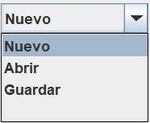
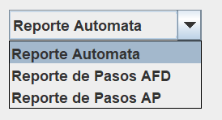

# Manual de Usuario - AutomataLab
### Nombre: Angel Emanuel Rodriguez Corado
### Carnet: 202404856 

# Vista Principal

En esta vista el usuario podra poner un automata en la entrada  y ver el resultado del analisis en la salida

### Ejecutar

Dandole click se inicializara la ejecucion de nuestra entrada.

### Archivo

- #### Nuevo

    Borra el texto de nuestra entrada para analaziar un nuevo texto.

- #### Abrir

    Nos abre un cuadro de texto y nos permite seleccionar un archivo con la extension .atm.

- #### Guardar

    Nos permite guardar un archivo con extension .atm, sobre el texto que hay en nuestra entrada.

### Reportes

Aqui nos abrira una ventana donde podremos visualizar los tokes obtenidos por el analisis lexico y en caso de haber
errores se nos mostraran igualmente tanto lexicos como sintacticos.

Tambien podremos ver los automatas cargados al hacer la ejecucion

# Generacion de reportes

Todo reporte generado se guardara en su respectiva carpeta dentro de la raiz del proyecto.

* ## Reporte Automata

    Aqui se mostrara el grafico de como esta creado el automata seleccionado

* ## Reporte de Pasos AFD

    Aqui se guardaron todos nuestros AFD's generados asi como las validaciones de cadenas de los mismos.

* ## Reporte de Pasos AP

    Aqui se guardaron todos nuestros AP's generados asi como las validaciones de cadenas de los mismos.

# Sintaxis del codigo a Analizar

## Comentarios

// Esto es un comentario de una sola linea.
/* Esto es un comentario
multilinea */

## Declaraciones

### AFD

<AFD Nombre="AFD_1">
N = {S, A, B, C}; // Estados
T = {0, 1}; // Alfabeto
I = {S}; // Estado Inicial
A = {B, C}; // Estados de Aceptacion
Transiciones:
S -> 1, A | 0, B ;
A -> 1, A | 0, B ;
B -> 0, C | 1, A ;
C -> 1, A;
</AFD>

### AP

<AP Nombre="AP_1">
N = {I, A, B, C, F}; // Estados
T = {a, b}; // Alfabeto
P = {a, b, #} // Simbolos de Pila
I = {I}; // Estado Inicial
A = {F}; // Estados de Aceptacion
Transiciones:
I ($) -> ($), A : (#) ;
A (a) -> ($), B : (a) ;
B (a) -> ($), B : (a) | (b) -> (a), C : ($) ;
C (b) -> (a), C : ($) | ($) -> (#), F : ($) ;
</AP>

## Funciones

- ### Ver Automatas

Esta funcion permitira ver un listado de los automatas creados y su tipo.
verAutomatas();

- ### Descripcion de Automata

Esta funcion permitira ver cada uno de los elementos que conforman el
automata, estados, alfabeto, estado inicial, estados de aceptacion y transiciones.
// desc(nombre del automata);
desc(AFD_1);

- ### Validacion de Cadena

Esta funcion permitira ver cada uno de los elementos que conforman el
automata, estados, alfabeto, estado inicial, estados de aceptacion y transiciones.
// Nombre_Del_Automata("cadena a validar");
AFD_1("110");
AP_1("aabb");